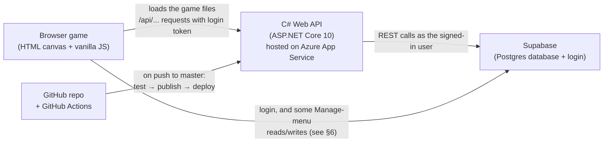

# PrettySmart — Architecture Notes

A cozy pixel-art study game. You walk around your apartment, sit at your desk, and study your own classes
(quizzes now, flashcards and "book" reading next). Correct quiz answers earn coins you can spend in a pet shop.

These notes explain how the pieces fit together, for a person or an AI picking up the project.

---

## 1. The big picture



| Piece | What it is | What it's responsible for |
|---|---|---|
| **Game (frontend)** | Plain HTML/CSS/JavaScript, drawn on a `<canvas>`. No framework, no build step. | Everything you see: the room, walking, menus, quiz screens, pet shop. |
| **API (backend)** | ASP.NET Core 10 minimal API in C# (`server/PrettySmart.Api`). | Serves the game files, checks who's logged in, owns game rules (quiz grading, points/coins, shop catalog). |
| **Supabase** | Hosted Postgres database + authentication. | Stores all user data (classes, chapters, flashcards, quiz questions, quiz answers) and handles sign-up/login. |
| **Azure App Service** | Microsoft's hosting. Web app `PrettySmartStudy`, Free F1 plan, .NET 10. | Runs the C# API on the internet so the game works from any device. |
| **GitHub Actions** | CI/CD pipeline (`.github/workflows/deploy-azure.yml`). | On every push to `master`: runs the tests, builds, and deploys to Azure. |

**Key design rule:** the browser is never trusted with game rules. It never sees correct quiz answers before
you answer, never decides how many points you get, and never decides who owns a row. The C# server does.

---

## 2. Tech stack

- **Frontend:** vanilla JavaScript (ES2020+), HTML5 canvas, CSS. Google Fonts (Fredoka, Nunito). Supabase JS client (from a CDN) for login.
- **Backend:** C# / .NET 10, ASP.NET Core minimal APIs, JWT bearer authentication, typed `HttpClient`.
- **Database & auth:** Supabase (Postgres + PostgREST + GoTrue auth). Row Level Security (RLS) on tables.
- **Tests:** xUnit + `WebApplicationFactory` integration tests (34 tests), with a fake Supabase so tests never touch real data.
- **Hosting/CI:** Azure App Service (Linux or Windows, Free F1) + GitHub Actions.

---

## 3. Folder layout

```
PrettySmart/
├── index.html, style.css        The game page and all its styling
├── js/                          Game code (one object per file, loaded with plain <script> tags)
├── assets/                      Pixel art: backgrounds, character, cats, fish, shop, study tools
├── server/
│   ├── PrettySmart.sln
│   ├── PrettySmart.Api/         The C# backend
│   │   ├── Program.cs           Startup: auth, static files, error handling, routes
│   │   ├── Endpoints/           API routes (classes, quiz, shop/coins)
│   │   ├── Quiz/QuizGrader.cs   Answer-checking logic
│   │   ├── Shop/catalog.json    Pet shop items — hand-editable, hot-reloads
│   │   ├── Shop/ShopCatalog.cs  Loads + validates catalog.json
│   │   ├── Supabase/            Client that calls Supabase as the logged-in user
│   │   └── Models/              Request/response and database row shapes
│   ├── PrettySmart.Api.Tests/   xUnit tests
│   └── sql/                     Database changes to run by hand in Supabase (001_, 002_, …)
├── docs/ARCHITECTURE.md         This file
└── .github/workflows/           Deploy pipeline
```

---

## 4. How a request works (login → quiz answer)

1. **Login.** The game logs in with Supabase directly (`js/auth.js`, email + password). Supabase returns an
   **access token** (a signed JWT) that proves who the user is.
2. **Calling the API.** `js/api.js` sends every `/api/...` request with `Authorization: Bearer <token>`.
3. **Checking the token.** The C# server verifies the token's signature using Supabase's **public** signing
   keys (ES256, discovered automatically from Supabase's OpenID configuration). No Supabase secret is
   stored anywhere. Bad or missing token → `401`.
4. **Talking to the database.** Two clients in `Supabase/SupabaseRest.cs`:
   - `SupabaseRest` — **reads as the user** by forwarding their token, so Row Level Security decides what they see.
   - `SupabaseAdmin` — **writes as the server** with the secret key, for game-economy data players must not
     forge (quiz answers, purchases, inventory, pets). Every admin write uses the user id from the verified token.
5. **Ownership.** When creating rows, the server takes `user_id` from the verified token, never from the
   request body.
6. **Errors.** Supabase errors become clean responses (`401/403` passed through, otherwise `502`).

Example, answering a quiz question (`POST /api/quiz/answers`):
the server loads the question (with its correct answer) → grades the submitted answer → records a row in
`quiz_answers` → returns `{ correct, correctAnswer, pointsEarned, totalPoints }`.

---

## 5. Data model (Supabase tables)

| Table | Key columns | Notes |
|---|---|---|
| `classes` | `id`, `name`, `user_id`, `created_at` | e.g. "MIS 405". The desk notebooks match these by name. |
| `chapters` | `id`, `class_id`, `title`, `content` | Book/chapter text pasted in Manage. No `created_at` — sort by `id`. |
| `flashcards` | `id`, `class_id`, `chapter_id` (nullable), `term`, `definition` | `chapter_id` added by `sql/002`. No `created_at`. |
| `quiz_questions` | `id`, `class_id`, `chapter_id` (nullable), `question`, `question_type` (`multiple_choice` / `type_in`), `is_math`, `choices` (array), `correct_answer` | No `created_at`. |
| `quiz_answers` | `id`, `user_id`, `class_id`, `chapter_id`, `question_id`, `is_correct`, `points`, `answered_at` | Created by `sql/001`. One row per answer. RLS: users can **read** their own; only the server inserts (since `sql/003`). |
| `purchases` | `id`, `user_id`, `item_id`, `quantity`, `price_paid`, `purchased_at` | `sql/003`. Every purchase. Read-own; server writes. |
| `inventory` | `user_id`, `item_id`, `quantity`, `updated_at` | `sql/003`. Equipment and food owned. Read-own; server writes. |
| `pets` | `id`, `user_id`, `species_id`, `kind`, `nickname`, `status`, `acquired_at` | `sql/003`. Each owned pet (many per species). Read-own; server writes. |

- **Coins** = points earned (`sum(quiz_answers.points)`) − coins spent (`sum(purchases.price_paid)`), calculated by
  the `coin_balance(user)` database function. Buying goes through `buy_item(...)`, which re-checks the balance
  under a per-player lock (all-or-nothing). Both functions are callable only with the server's secret key.
- **Chapter average** = % correct over the **last 30** answers in that chapter.
- **Schema changes** live in `server/sql/` and are run **by hand** in the Supabase SQL Editor, in order.
  They are *not* applied by the deploy. The scripts copy id column types from existing tables, so they work
  whether ids are numbers or UUIDs.
- The original tables (`classes`, `chapters`, `flashcards`, `quiz_questions`) and their RLS policies were
  created in the Supabase dashboard, not from scripts in this repo.

---

## 6. Who talks to the database (current state)

The project is **mid-migration** from "browser talks to Supabase directly" to "browser talks to the C# API":

| Feature | Goes through C# API? |
|---|---|
| Login / sign-up | No — Supabase directly (normal for Supabase auth) |
| Classes (list/add/delete) | **Yes** — `/api/classes` |
| Quiz (chapters, questions, grading, points) | **Yes** — `/api/quiz/...` |
| Coins, pet shop catalog, buying, My Pets | **Yes** — `/api/coins`, `/api/shop/...`, `/api/me`, `/api/pets/{id}` |
| Manage menu: chapters, flashcards, quiz questions (add/delete/list) | No — still `DB.from(...)` in `js/manage.js` |

Next step for that is moving the Manage-menu calls behind API endpoints, the same way classes were moved.

---

## 7. API endpoints

All require a logged-in user except `/api/health`.

| Method | Path | Purpose |
|---|---|---|
| GET | `/api/health` | Health check |
| GET / POST / DELETE | `/api/classes`, `/api/classes/{id}` | List / create / delete classes |
| GET | `/api/quiz/chapters?classId=` | Chapters with question counts and last-30 % correct |
| GET | `/api/quiz/questions?classId=&chapterId=` | Shuffled questions **without answers** (`chapterId=none` for unassigned) |
| POST | `/api/quiz/answers` | Grade `{ questionId, answer }`, record it, award points |
| GET | `/api/quiz/points`, `/api/coins` | Total coins |
| GET | `/api/shop/items`, `/api/shop/items/{id}` | Pet shop catalog |

**Grading rules** (`Quiz/QuizGrader.cs`): case-insensitive, trims and collapses spaces. For math/type-in
questions, numbers are compared numerically, so `1,000`, `$1000` and `1000.0` all match `1000`.

---

## 8. The game client (`js/`)

Each file defines one global object. Load order is set in `index.html`; `auth.js` starts the game only after
all scripts load (`DOMContentLoaded`), which avoids a startup race.

| File | Role |
|---|---|
| `db.js` | Creates the Supabase client (`DB`) with the public publishable key |
| `api.js` | `Api.get/post/del` — calls the C# API with the login token |
| `auth.js` | Login/register form; on login starts everything (`start()`) |
| `main.js` | Game loop (update → draw every frame), keyboard/mouse wiring, asset loading |
| `room.js` | Background images by time of day, walkable floor, furniture hitboxes |
| `camera.js` | Fills the screen with the background (no borders), zoomed on the bedroom (`extraZoom`) |
| `player.js` | Character movement (WASD), collision, sprite drawing |
| `input.js`, `assets.js` | Keyboard state; image loading |
| `study.js` | Desk menu (E at desk): notebooks → Book / Flashcards / Quiz; quiz screens |
| `manage.js` | Manage menu: classes, chapters, flashcards, quiz questions (grouped by chapter) |
| `petshop.js` | Pet shop drawn on the canvas; fish/cat shelves with paging; click → profile |
| `coins.js` | Coin balance button; pet profile card |

**Coordinates:** all room positions (floor, furniture hitboxes, desk, player) are **pixels on the background
image**, which is 1821 × 864. All six time-of-day backgrounds share that exact size and layout, so one set of
hitboxes works for all. Press **H** in game to see hitboxes. If the background art changes scale or layout,
the numbers in `room.js`, `player.js` (size/speed) and `study.js` (`_desk`) must be remeasured.

**Time of day:** `Room.backgrounds` in `room.js` maps a starting hour (24h) to an image:
5am dawn · 6am morning · 8am day · 5pm evening · 7pm dusk · 8pm night.

**Menus** are HTML overlays on top of the canvas (study, manage, pet profile), except the pet shop shelf,
which is drawn on the canvas with click hit-testing.

---

## 9. Content you can edit without code

- **Pet shop:** `server/PrettySmart.Api/Shop/catalog.json` — name, type (breed/family), price, description,
  personality, care (1–3). Don't change `id` (it's the image name) or `kind`. Locally, saving the file updates
  the game on refresh; a broken edit keeps the last good version and logs the problem. On the live site,
  edits go out with the next push.
- **New cat:** add `assets/cat/<id>front.png` (plus back/left/right/sleep), add `<id>` to `CATS` in
  `js/petshop.js`, add a catalog entry. Tests fail if a cat or fish image has no catalog entry.
- **Backgrounds:** same size/layout as the others; update `Room.backgrounds` if times or files change.
- **Camera zoom:** `extraZoom` in `js/camera.js` (currently 1.2; 1.0 = widest without borders).

---

## 10. Configuration & secrets

| Setting | Where | Secret? |
|---|---|---|
| Supabase URL + **publishable** key | `js/db.js`, `appsettings.json` | No — designed to be public; RLS protects data |
| Where the game files are | `GameRoot` in `appsettings*.json` (`../..` in development, `game` when published) | No |
| Supabase **secret** key (server-only, bypasses RLS) | .NET user-secrets locally (`Supabase:SecretKey`); Azure App Service → Environment variables (`Supabase__SecretKey`) | **Yes** — never in JS, appsettings.json or the repo |
| Azure deploy credentials | GitHub secret `AZURE_WEBAPP_PUBLISH_PROFILE` | **Yes** — never commit or paste it |
| Azure app name | GitHub variable `AZURE_WEBAPP_NAME` (`PrettySmartStudy`) | No |
| Future AI API key (OpenAI etc.) | Should go in Azure App Service → Configuration (environment variable) | **Yes** — never in JS or the repo |

The server only exposes `/`, `index.html`, `style.css`, `js/`, `assets/` and `/api/`. Server code, config files
and `.git` return 404.

---

## 11. Running, testing, deploying

**Run locally** (needs the .NET 10 SDK):
```sh
cd server/PrettySmart.Api
dotnet run
```
Open http://localhost:5173. Opening `index.html` directly does **not** work — the game needs the API.

**Test:**
```sh
cd server
dotnet test
```

**Deploy:** push to `master`. GitHub Actions runs the tests, then `dotnet publish` (which bundles the game
files into the app under `game/`), then deploys to Azure. If the tests fail, nothing deploys.

**Free-tier note:** the Azure app sleeps when idle; the first load after a break can take ~20–30 seconds.

---

## 12. Gotchas learned the hard way

- `chapters`, `flashcards`, `quiz_questions` have **no `created_at`** column — order by `id`.
- Opening the game as a file (`file://…/index.html`) breaks all API calls. Always use the server URL.
- New Azure accounts can have a **0 quota** for Free F1 apps; school Azure accounts may not allow creating
  resources at all. A personal account and a different region/OS combination worked.
- PostgREST's `Content-Range` header has no unit, so .NET won't parse it as a typed header — `CountAsync`
  reads it raw.
- Linux hosting is case-sensitive: asset file names in code must match exactly.

---

## 13. Roadmap / ideas

The pet care system (requirements, stats, equipment, death) is planned in detail in
[PET_CARE_DESIGN.md](PET_CARE_DESIGN.md).

- Buy button in the pet shop (needs a purchases table; coins balance = earned − spent).
- Flashcards and Book reading at the desk.
- Move the Manage menu's direct Supabase calls behind the API.
- AI-generated quiz questions/flashcards from chapter text (API key on the server, review-before-save).
- Use the cats' side/sleep sprites for a pet that walks around the room.
